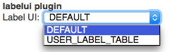
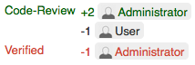
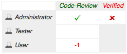

The @PLUGIN@ plugin allows users to configure a different control for
displaying the labels/approvals on the change screen.

User can configure the label UI under `Settings` > `Preferences` >
`Label UI`:

### `DEFAULT`

The Gerrit default control for labels/approvals:

### `TABLE`

Renders the labels/approvals as a table:

