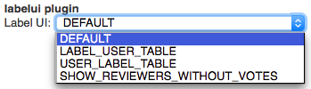

The @PLUGIN@ plugin allows users to configure a different control for
displaying the labels/approvals on the change screen.

User can configure the label UI under `Settings` > `Preferences` >
`Label UI`:

### `DEFAULT`

The Gerrit default control for labels/approvals:

### `LABEL_USER_TABLE`

Renders the labels/approvals as a table with one row per label and
users as columns:

### `USER_LABEL_TABLE`

Renders the labels/approvals as a table with one row per user and
labels as columns:

### `SHOW_REVIEWERS_WITHOUT_VOTES`

Adds an additional row to the default control for labels/approvals that
shows the reviewers that have not voted:

